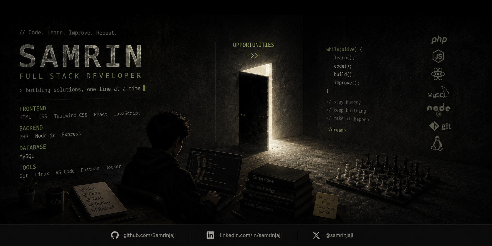

  

###

<h1 align="left">Hi there 👋, I'm Samrin Jaji</h1>

###

💻 Full Stack Developer |   Linux Enthusiast |  Cybersecurity Learner

###

<h2 align="left">🚀 About Me</h2>

###

- 💻 Backend & Full Stack Developer 
- 🌱 Currently Cybersecurity, Docker, Linux 
- ⚡ Interested in Backend Development & Cybersecurity 
- 🔭 Building projects to improve my skills 
- 📍 Philippines

###

<h2 align="left">Skills & Tools</h2>

###

## 🛠 Tech Stack

### Languages

### Frontend

### Backend

### Tools

###

### ✍️ Random Dev Quote

  

